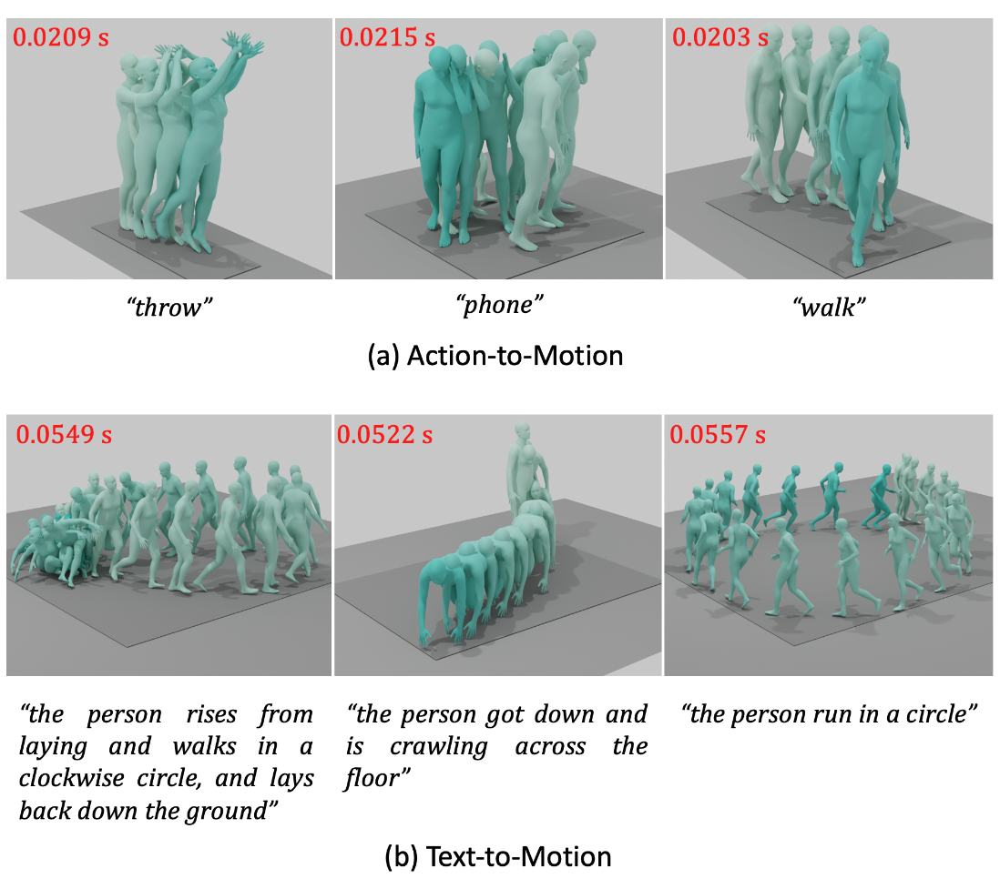

# Introduction
Official code for the paper **[EMDM: Efficient Motion Diffusion Model for Fast, High-Quality Motion Generation](https://arxiv.org/abs/2312.02256), Arxiv 2023**.


[[Project Page](https://frank-zy-dou.github.io/projects/EMDM/index.html)][[Paper](https://arxiv.org/abs/2312.02256)][[Video](https://www.youtube.com/watch?si=atUuUP4eLbXQjixc&v=1SyCXbnol_g&feature=youtu.be&ab_channel=FrankZhiyangDou)]
<p align="center">

</p>
We introduce Efficient Motion Diffusion Model (EMDM) for fast and high-quality human motion generation. Although previous motion diffusion models have shown impressive results, they struggle to achieve fast generation while maintaining high-quality human motions. Motion latent diffusion has been proposed for efficient motion generation. However, effectively learning a latent space can be non-trivial in such a two-stage manner. Meanwhile, accelerating motion sampling by increasing the step size, e.g., DDIM, typically leads to a decline in motion quality due to the inapproximation of complex data distributions when naively increasing the step size. In this paper, we propose EMDM that allows for much fewer sample steps for fast motion generation by modeling the complex denoising distribution during multiple sampling steps. Specifically, we develop a Conditional Denoising Diffusion GAN to capture multimodal data distributions conditioned on both control signals, i.e., textual description and denoising time step. By modeling the complex data distribution, a larger sampling step size and fewer steps are achieved during motion synthesis, significantly accelerating the generation process. To effectively capture the human dynamics and reduce undesired artifacts, we employ motion geometric loss during network training, which improves the motion quality and training efficiency. As a result, EMDM achieves a remarkable speed-up at the generation stage while maintaining high-quality motion generation in terms of fidelity and diversity.
# Citation
```angular2html
@article{zhou2023emdm,
  title={EMDM: Efficient Motion Diffusion Model for Fast, High-Quality Motion Generation},
  author={Zhou, Wenyang and Dou, Zhiyang and Cao, Zeyu and Liao, Zhouyingcheng and Wang, Jingbo and Wang, Wenjia and Liu, Yuan and Komura, Taku and Wang, Wenping and Liu, Lingjie},
  journal={arXiv preprint arXiv:2312.02256},
  year={2023}
}
```


